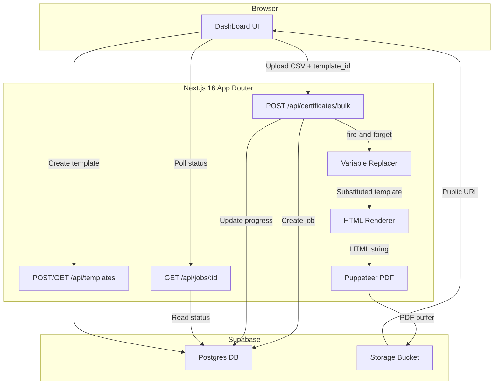
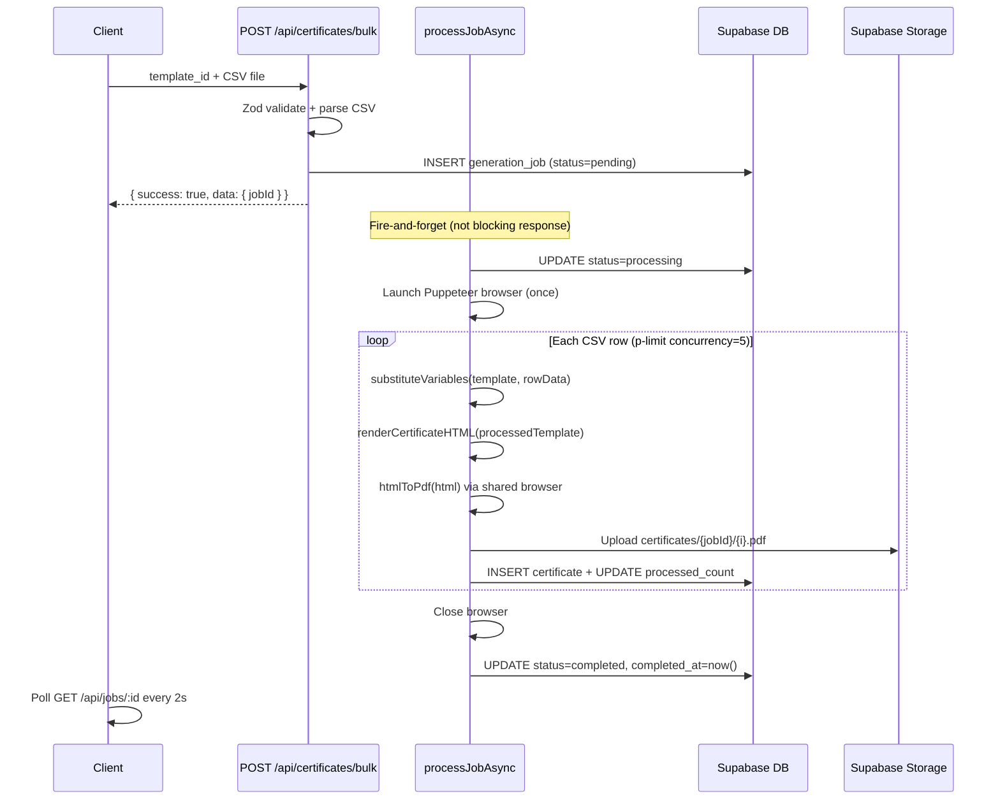

# Certificate Generator SaaS — Implementation Plan (Revised)

Aligned with project agents (`pdf-generator`, `job-processor`, `data-processor`, `backend-builder`, `frontend-builder`) and the `certificate-saas` skill.

## Architecture Overview



## Rendering Pipeline (from pdf-generator agent)

```
Template JSON --> Variable Substitution --> HTML Rendering --> Puppeteer PDF Conversion --> Supabase Storage Upload
```

Never skip steps or generate PDF directly from raw data. Never hardcode text, positions, or styles -- derive everything from template JSON.

## Key Technical Decisions

- **PDF Generation**: `puppeteer-core` + `@sparticuz/chromium` -- HTML-to-PDF pipeline per the `pdf-generator` agent. Renders template as positioned HTML, converts with Puppeteer. `@sparticuz/chromium` is in Next.js default server externals for seamless serverless deployment.
- **CSV Parsing**: `papaparse` 5.5.3 with structured `CSVParseResult` output including `summary` (per `data-processor` agent)
- **Input Validation**: `zod` 4.3.6 on all API inputs (per `backend-builder` agent)
- **Concurrency Control**: `p-limit` 7.3.0 capped at 5 concurrent PDF generations to prevent memory spikes (per `job-processor` agent)
- **Background Processing**: Fire-and-forget `processJobAsync()` -- API creates job and returns immediately, processing runs asynchronously (per `job-processor` agent)
- **Supabase Client**: Service-role admin client for server-side operations, browser client for UI
- **Frontend**: Server Components by default, `"use client"` only when interactivity is required (per `frontend-builder` agent)
- **Response Format**: All APIs return `{ success: true, data }` or `{ success: false, error }` (per `backend-builder` agent)

## Folder Structure

```
src/
├── app/
│   ├── layout.tsx                        # Root layout + nav
│   ├── page.tsx                          # Dashboard (Server Component)
│   ├── templates/
│   │   ├── page.tsx                      # List templates (Server Component)
│   │   ├── new/
│   │   │   ├── page.tsx                  # Create template
│   │   │   └── _components/
│   │   │       └── template-form.tsx     # Client Component (interactive form)
│   │   └── [id]/page.tsx                 # View template
│   ├── generate/
│   │   ├── page.tsx                      # Bulk generation
│   │   └── _components/
│   │       └── generate-form.tsx         # Client Component (CSV upload + submit)
│   ├── jobs/
│   │   └── [id]/
│   │       ├── page.tsx                  # Job status (Server Component shell)
│   │       └── _components/
│   │           └── job-poller.tsx         # Client Component (polls progress)
│   └── api/
│       ├── templates/
│       │   ├── route.ts                  # POST create, GET list
│       │   └── [id]/route.ts             # GET by id
│       ├── certificates/
│       │   └── bulk/route.ts             # POST bulk generate
│       └── jobs/
│           └── [id]/route.ts             # GET job status
├── components/
│   └── ui/                               # Shared reusable components
│       ├── button.tsx
│       ├── card.tsx
│       └── progress-bar.tsx
├── lib/
│   ├── supabase/
│   │   ├── client.ts                     # Browser client (createBrowserClient)
│   │   └── admin.ts                      # Service-role admin client
│   ├── engine/
│   │   ├── variable-replacer.ts          # extractVariables + substituteVariables
│   │   ├── csv-parser.ts                 # parseAndValidate -> CSVParseResult
│   │   ├── html-renderer.ts             # Template JSON -> HTML string
│   │   └── pdf-generator.ts              # HTML -> PDF via Puppeteer
│   ├── services/
│   │   ├── template-service.ts           # Template CRUD
│   │   ├── job-service.ts                # Job lifecycle (state machine)
│   │   └── certificate-service.ts        # Orchestration with p-limit
│   ├── schemas.ts                        # Zod validation schemas
│   ├── types.ts                          # Shared TypeScript types
│   └── errors.ts                         # Structured error classes
├── data/
│   ├── sample-template.json
│   └── sample-data.csv
next.config.ts                            # serverExternalPackages for chromium
.env.local.example
```

## Database Schema (3 tables + RLS)

Per `backend-builder` agent: snake_case tables, `created_at`/`updated_at` on all, RLS enabled, indexed query columns.

```sql
-- certificate_templates: stores layout as JSON
CREATE TABLE certificate_templates (
  id             UUID PRIMARY KEY DEFAULT gen_random_uuid(),
  name           TEXT NOT NULL,
  width          INTEGER NOT NULL DEFAULT 1920,
  height         INTEGER NOT NULL DEFAULT 1080,
  background_url TEXT,
  fields         JSONB NOT NULL DEFAULT '[]',
  created_at     TIMESTAMPTZ NOT NULL DEFAULT now(),
  updated_at     TIMESTAMPTZ NOT NULL DEFAULT now()
);

-- generation_jobs: tracks bulk generation progress
CREATE TABLE generation_jobs (
  id              UUID PRIMARY KEY DEFAULT gen_random_uuid(),
  template_id     UUID NOT NULL REFERENCES certificate_templates(id) ON DELETE CASCADE,
  status          TEXT NOT NULL DEFAULT 'pending'
                    CHECK (status IN ('pending','processing','completed','failed')),
  total_count     INTEGER NOT NULL DEFAULT 0,
  processed_count INTEGER NOT NULL DEFAULT 0,
  error_count     INTEGER NOT NULL DEFAULT 0,
  errors          JSONB DEFAULT '[]',
  created_at      TIMESTAMPTZ NOT NULL DEFAULT now(),
  updated_at      TIMESTAMPTZ NOT NULL DEFAULT now(),
  completed_at    TIMESTAMPTZ
);

-- certificates: one row per generated cert
CREATE TABLE certificates (
  id            UUID PRIMARY KEY DEFAULT gen_random_uuid(),
  job_id        UUID NOT NULL REFERENCES generation_jobs(id) ON DELETE CASCADE,
  template_id   UUID NOT NULL REFERENCES certificate_templates(id) ON DELETE CASCADE,
  row_data      JSONB NOT NULL,
  file_url      TEXT,
  storage_path  TEXT,
  created_at    TIMESTAMPTZ NOT NULL DEFAULT now()
);

-- Indexes for query performance
CREATE INDEX idx_generation_jobs_template_id ON generation_jobs(template_id);
CREATE INDEX idx_generation_jobs_status ON generation_jobs(status);
CREATE INDEX idx_certificates_job_id ON certificates(job_id);

-- RLS (enabled on all tables, open for MVP -- tighten with auth later)
ALTER TABLE certificate_templates ENABLE ROW LEVEL SECURITY;
ALTER TABLE generation_jobs ENABLE ROW LEVEL SECURITY;
ALTER TABLE certificates ENABLE ROW LEVEL SECURITY;

CREATE POLICY "allow_all_certificate_templates" ON certificate_templates FOR ALL USING (true);
CREATE POLICY "allow_all_generation_jobs" ON generation_jobs FOR ALL USING (true);
CREATE POLICY "allow_all_certificates" ON certificates FOR ALL USING (true);
```

Storage bucket: `certificates` (public) for PDF uploads. Path convention: `certificates/{jobId}/{index}.pdf`

## Template Structure (from skill)

```json
{
  "name": "Course Completion",
  "width": 1920,
  "height": 1080,
  "backgroundUrl": "https://example.com/bg.png",
  "fields": [
    { "type": "text", "value": "Certificate of Completion", "x": 960, "y": 200, "fontSize": 48, "color": "#1a1a2e", "fontWeight": "bold" },
    { "type": "text", "value": "{{name}}", "x": 960, "y": 400, "fontSize": 36, "color": "#16213e" },
    { "type": "text", "value": "{{course}}", "x": 960, "y": 500, "fontSize": 24, "color": "#0f3460" },
    { "type": "text", "value": "{{date}}", "x": 960, "y": 600, "fontSize": 18, "color": "#533483" },
    { "type": "image", "value": "https://example.com/logo.png", "x": 960, "y": 100, "width": 120, "height": 120 }
  ]
}
```

## Zod Schemas (from patterns + backend-builder agent)

```typescript
const TemplateFieldSchema = z.object({
  type: z.enum(["text", "image"]),
  value: z.string(),
  x: z.number(),
  y: z.number(),
  fontSize: z.number().optional(),
  color: z.string().optional(),
  fontWeight: z.string().optional(),
  width: z.number().optional(),
  height: z.number().optional(),
});

const CreateTemplateSchema = z.object({
  name: z.string().min(1).max(100),
  width: z.number().int().positive().optional(),
  height: z.number().int().positive().optional(),
  backgroundUrl: z.string().url().optional(),
  fields: z.array(TemplateFieldSchema).min(1),
});

const BulkGenerateSchema = z.object({
  templateId: z.string().uuid(),
});
```

## Core Engine Modules

### 1. Variable Replacer (`lib/engine/variable-replacer.ts`)

From the `pdf-generator` agent pattern:

- `extractVariables(template)` -- regex scans all field values for `{{varName}}`, returns deduplicated `string[]`
- `substituteVariables(template, data)` -- deep-clones template, replaces `{{key}}` with `data[key] ?? ""` in every field value

### 2. CSV Parser (`lib/engine/csv-parser.ts`)

From the `data-processor` agent -- structured output with summary:

- `parseAndValidate(csvText, requiredHeaders)` returns `CSVParseResult`:
  - `headers: string[]`
  - `rows: Record<string, string>[]` (valid rows only, trimmed)
  - `errors: { row: number, field: string, message: string }[]`
  - `summary: { totalRows, validRows, invalidRows }`
- Validates headers before processing any rows
- Skips empty rows with warning, trims whitespace, rejects duplicate headers

### 3. HTML Renderer (`lib/engine/html-renderer.ts`)

New module (separating rendering from PDF conversion per pipeline):

- `renderCertificateHTML(template)` -- generates an HTML string with:
  - Fixed-dimension container matching template width/height
  - Background image or color
  - Absolutely positioned elements derived from template fields
  - Inline styles only (no external CSS dependencies)

### 4. PDF Generator (`lib/engine/pdf-generator.ts`)

From the `pdf-generator` agent -- Puppeteer-based:

- `htmlToPdf(html, width, height)` -- launches `@sparticuz/chromium`, renders HTML, exports PDF buffer
- Reuses browser instance within a batch (avoid 1-2s startup per cert)
- Always closes browser after batch completes
- `next.config.ts` adds `@sparticuz/chromium` to `serverExternalPackages`

## Bulk Generation Flow



## API Endpoints (thin handlers, 10-15 lines max)

All handlers: parse input with Zod, delegate to service, return `{ success, data/error }`.

- **POST /api/templates** -- `CreateTemplateSchema.parse(body)` -> `templateService.create()` -> `{ success: true, data: template }`
- **GET /api/templates** -- `templateService.list()` -> `{ success: true, data: templates }`
- **GET /api/templates/[id]** -- `templateService.getById(id)` -> `{ success: true, data: template }`
- **POST /api/certificates/bulk** -- multipart form: `templateId` + CSV `file` -> validate CSV against template vars -> create job -> fire-and-forget -> `{ success: true, data: { jobId } }`
- **GET /api/jobs/[id]** -- `jobService.getById(id)` with certificates when completed -> `{ success: true, data: { job, certificates? } }`

## UI Pages (from frontend-builder agent)

Server Components by default. Client Components only in `_components/` folders.

- **Dashboard (`/`)** -- Server Component. Quick stats + action cards (create template, start generation)
- **Templates List (`/templates`)** -- Server Component. Fetches templates server-side, renders card grid
- **New Template (`/templates/new`)** -- Server Component shell + `_components/template-form.tsx` Client Component for interactive field builder with live JSON preview
- **Generate (`/generate`)** -- Server Component loads templates for dropdown + `_components/generate-form.tsx` Client Component for CSV upload, validation feedback, and submit
- **Job Status (`/jobs/[id]`)** -- Server Component fetches initial job state + `_components/job-poller.tsx` Client Component that polls every 2s, shows progress bar, renders download links when done

## Error Handling (from backend-builder agent)

- Structured error classes: `AppError` base, `ValidationError`, `StorageError`, `TemplateNotFoundError`
- Never expose raw errors to client -- always wrapped
- API response shape on error: `{ success: false, error: "Human-readable message" }`
- CSV errors include row-level detail in the `errors` array
- A single row failure does NOT abort the batch -- logged in `errors` JSONB, `error_count` incremented (per `job-processor` agent)

## Dependencies (latest versions as of April 2026, managed with pnpm)

Package manager: **pnpm**. Project scaffolded with `pnpm create next-app`, all installs via `pnpm add` / `pnpm add -D`.

```json
{
  "packageManager": "pnpm",
  "dependencies": {
    "next": "16.2.1",
    "@supabase/supabase-js": "2.101.1",
    "@supabase/ssr": "0.10.0",
    "puppeteer-core": "24.40.0",
    "@sparticuz/chromium": "143.0.4",
    "papaparse": "5.5.3",
    "p-limit": "7.3.0",
    "zod": "4.3.6"
  },
  "devDependencies": {
    "typescript": "latest",
    "@types/papaparse": "latest",
    "@types/node": "latest",
    "@tailwindcss/postcss": "4.2.2",
    "tailwindcss": "4.2.2"
  }
}
```

## next.config.ts

```typescript
const nextConfig = {
  serverExternalPackages: ["@sparticuz/chromium"],
};
```

## Sample Data

- **sample-template.json**: "Course Completion Certificate" with background, title, `{{name}}`, `{{course}}`, `{{date}}` variable fields
- **sample-data.csv**: 5 rows demonstrating end-to-end flow
- **README.md**: Full request/response flow example showing POST template -> POST bulk -> poll job -> download PDFs

