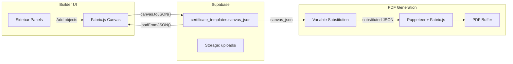

# Visual Certificate Builder

## Architecture Change

The current form-based template creator at `/templates/new` will be replaced by a full-screen visual builder at `/builder` (new route) and `/builder/[id]` (edit existing). The standard app layout (nav bar) is hidden in builder mode -- the builder gets a dedicated full-viewport layout.

### Canvas Library: Fabric.js v7

Fabric.js v7.1.0 is the best fit because:

- Built-in JSON serialization (`canvas.toJSON()` / `canvas.loadFromJSON()`) maps directly to Supabase JSONB storage
- Native selection, drag, resize, rotate, grouping, z-ordering
- TypeScript support, ESM imports
- Mature ecosystem (10+ years, used in production editors)
- Rich text object with font, color, weight, alignment
- Image object with crossOrigin, filters
- Shape primitives (Rect, Circle, Triangle, Line, Polygon)

### Data Flow




### Template Storage Change

Currently `fields: JSONB` stores a simple `TemplateField[]`. The new system adds a `canvas_json: JSONB` column to `certificate_templates` that stores the full Fabric.js canvas serialization. The `fields` column is kept for backward compatibility but new templates use `canvas_json`. A `paper_size` column is also added.

**DB migration:**

```sql
ALTER TABLE certificate_templates ADD COLUMN canvas_json JSONB;
ALTER TABLE certificate_templates ADD COLUMN paper_size TEXT NOT NULL DEFAULT 'A4';
```

### PDF Generation Pipeline Change

**Current:** `fields JSON -> substituteVariables -> renderCertificateHTML -> Puppeteer PDF`

**New:** `canvas_json -> substituteVariables (scan Fabric text objects) -> Puppeteer loads page with Fabric.js -> loadFromJSON -> canvas.toDataURL() -> PDF`

The new `canvas-renderer.ts` generates an HTML page that:

1. Includes Fabric.js via CDN
2. Creates a canvas at the template dimensions
3. Calls `loadFromJSON(canvasJson)` to render all objects
4. Exports to image/PDF

### Variable Replacement Update

The variable replacer in [src/lib/engine/variable-replacer.ts](src/lib/engine/variable-replacer.ts) needs a new function `substituteCanvasVariables(canvasJson, data)` that walks all Fabric `text`/`i-text`/`textbox` objects in the JSON and replaces `{{var}}` in their `text` property.

---

## New Dependencies

```
pnpm add fabric qrcode
pnpm add -D @types/qrcode
```

- `fabric` v7.1.0 -- canvas editor
- `qrcode` -- server-side QR code generation (returns data URLs to add as images)

---

## File Structure (new/modified files)

```
src/
├── app/
│   ├── builder/
│   │   ├── layout.tsx                     # Full-screen layout (no nav)
│   │   ├── page.tsx                       # New template builder
│   │   ├── [id]/page.tsx                  # Edit existing template
│   │   └── _components/
│   │       ├── certificate-builder.tsx    # Main orchestrator (client)
│   │       ├── canvas-editor.tsx          # Fabric.js canvas wrapper
│   │       ├── toolbar.tsx                # Top bar: name, paper size, preview, save
│   │       ├── preview-modal.tsx          # Live preview with data substitution
│   │       └── sidebar/
│   │           ├── sidebar.tsx            # Tab container
│   │           ├── templates-panel.tsx    # Pre-built templates
│   │           ├── uploads-panel.tsx      # Image upload + gallery
│   │           ├── elements-panel.tsx     # Shapes, lines, icons, ribbons
│   │           ├── text-panel.tsx         # Text styles + combinations
│   │           ├── attributes-panel.tsx   # Dynamic variable insertion
│   │           ├── qrcodes-panel.tsx      # QR code generator
│   │           └── layers-panel.tsx       # Layer ordering
│   ├── api/
│   │   └── uploads/
│   │       └── route.ts                   # POST image upload to Supabase Storage
├── lib/
│   ├── engine/
│   │   ├── variable-replacer.ts           # Add substituteCanvasVariables()
│   │   ├── canvas-renderer.ts             # NEW: Fabric.js canvas -> PDF via Puppeteer
│   │   └── html-renderer.ts              # Kept for backward compat
│   ├── builder/
│   │   ├── fabric-utils.ts               # Canvas helpers (add text, shape, image, etc.)
│   │   ├── preset-templates.ts           # Built-in template JSON definitions
│   │   └── decorative-assets.ts          # SVG paths for ribbons, medals, icons
│   ├── types.ts                           # Add canvas_json, paper_size to types
│   └── schemas.ts                         # Update CreateTemplateSchema
├── data/
│   └── templates/                         # Pre-built template JSON files
│       ├── course-completion.json
│       ├── achievement-award.json
│       └── professional-cert.json
```

---

## Sidebar Panels Detail

### 1. Templates Panel (`templates-panel.tsx`)

- Grid of thumbnail previews (landscape / portrait toggle)
- 3+ built-in templates stored as Fabric.js JSON in `src/data/templates/`
- Click loads template into canvas via `canvas.loadFromJSON()`

### 2. Uploads Panel (`uploads-panel.tsx`)

- Upload button (SVG, PNG, JPG, up to 2MB)
- Uploads to Supabase Storage bucket `uploads/`
- Gallery of previously uploaded images
- Click adds `FabricImage` to canvas

### 3. Elements Panel (`elements-panel.tsx`)

- **Shapes**: Rectangle, Square, Circle, Triangle (filled + outlined variants)
- **Lines**: Horizontal, Vertical
- **Icons**: Star, Medal/Badge, Checkmark, Seal (SVG paths rendered as Fabric `Path` objects)
- **Ribbons**: Decorative ribbon shapes (SVG paths)
- Click adds the element to canvas center

### 4. Text Panel (`text-panel.tsx`)

- **Styles**: Add Heading (48px bold), Add Subheading (28px semibold), Add Normal Text (16px)
- **Combinations**: Pre-built text groups:
  - "Certificate of Completion" + `{{name}}` block
  - Signature block (name + title)
  - Certificate ID + Issue Date block
- Click adds `Textbox` (or `IText`) to canvas

### 5. Attributes Panel (`attributes-panel.tsx`)

- Categorized dynamic variables:
  - **Recipient**: `{{name}}`, `{{email}}`
  - **Certificate**: `{{certificate_id}}`, `{{issued_date}}`, `{{expiry_date}}`
  - **Issuer**: `{{issuer_name}}`, `{{issuer_email}}`
  - **Custom**: User-defined variables
- "Use" button inserts a `Textbox` with the placeholder text (e.g. `{{name}}`)
- Variables are highlighted in a distinct style on canvas

### 6. QR Codes Panel (`qrcodes-panel.tsx`)

- **Verification Page**: Generates QR for `{{verification_url}}`
- **Custom URL**: Input field for any URL
- Uses `qrcode` library to generate data URL, adds as `FabricImage` to canvas

### 7. Layers Panel (`layers-panel.tsx`)

- List of all canvas objects (name, type icon, thumbnail)
- Drag to reorder (changes z-index via `canvas.moveTo()`)
- Eye icon to toggle visibility (`object.visible`)
- Lock icon to toggle selectability (`object.selectable`)

---

## Toolbar (`toolbar.tsx`)

- Template name input (editable inline)
- Paper size dropdown: A4 (595x842pt), US Letter (612x792pt), Landscape variants, Custom
- "Add Background Image" button
- Preview button (opens modal with data substitution)
- Save button (serializes canvas to JSON, saves to Supabase)
- Download/Export as PDF button

---

## Canvas Editor (`canvas-editor.tsx`)

The core Fabric.js wrapper component. Key responsibilities:

- Initialize `fabric.Canvas` on mount, `dispose()` on unmount
- Expose canvas ref to parent via `useImperativeHandle` or context
- Handle keyboard shortcuts (Delete to remove, Ctrl+Z undo, Ctrl+C/V copy/paste)
- Maintain undo/redo stack (store JSON snapshots)
- Render selection toolbar (when object selected: color, font, alignment, opacity, delete)
- Zoom controls (fit, zoom in/out, percentage display)
- Grid/snap-to-grid toggle

---

## Preview Modal (`preview-modal.tsx`)

- Shows rendered certificate with sample data filled in
- Input fields for each detected `{{variable}}` so user can type test values
- Real-time re-render as user types
- "Reset to Default Data" button

---

## Key Integration Points

### Saving a Template

```
canvas.toJSON() -> POST /api/templates (canvas_json field) -> Supabase
```

The [src/app/api/templates/route.ts](src/app/api/templates/route.ts) POST handler and [src/lib/schemas.ts](src/lib/schemas.ts) `CreateTemplateSchema` need updating to accept `canvasJson` and `paperSize`.

### Generating PDFs from Canvas Templates

The [src/lib/services/certificate-service.ts](src/lib/services/certificate-service.ts) `generateAndTrack()` function checks if the template has `canvas_json`:

- If yes: use new `canvas-renderer.ts` pipeline
- If no (legacy): use existing `html-renderer.ts` pipeline

The new `canvas-renderer.ts` creates an HTML page with:

```html
<script src="https://cdn.jsdelivr.net/npm/fabric@7/dist/index.min.js"></script>
<canvas id="c" width="WIDTH" height="HEIGHT"></canvas>
<script>
  const canvas = new fabric.Canvas('c');
  canvas.loadFromJSON(CANVAS_JSON).then(() => { canvas.renderAll(); });
</script>
```

Puppeteer loads this page, waits for render, then exports PDF.

### Updating Variable Replacer

Add to [src/lib/engine/variable-replacer.ts](src/lib/engine/variable-replacer.ts):

```typescript
export function extractCanvasVariables(canvasJson: object): string[] {
  // Walk all objects, find text/textbox types, extract {{var}} from text property
}

export function substituteCanvasVariables(
  canvasJson: object, data: Record<string, string>
): object {
  // Deep clone, replace {{var}} in all text objects' text property
}
```

---

## Navigation Updates

- Add "Builder" link to nav in [src/app/layout.tsx](src/app/layout.tsx)
- Update "Create Template" links on dashboard and templates page to point to `/builder`
- Keep `/templates/new` working for backward compatibility but redirect to `/builder`

